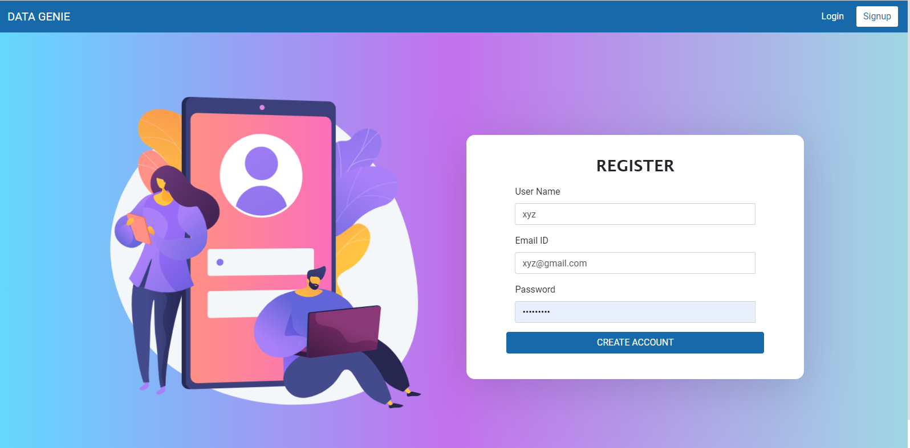
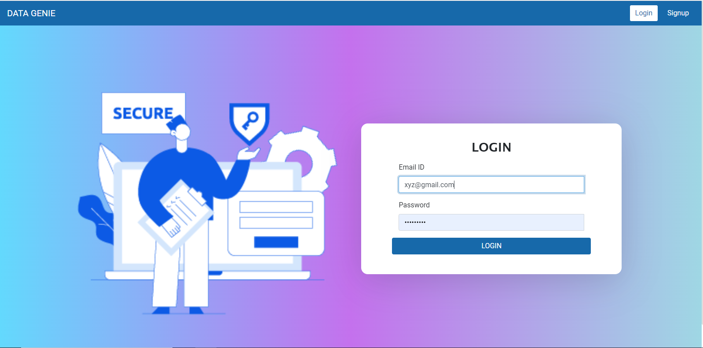
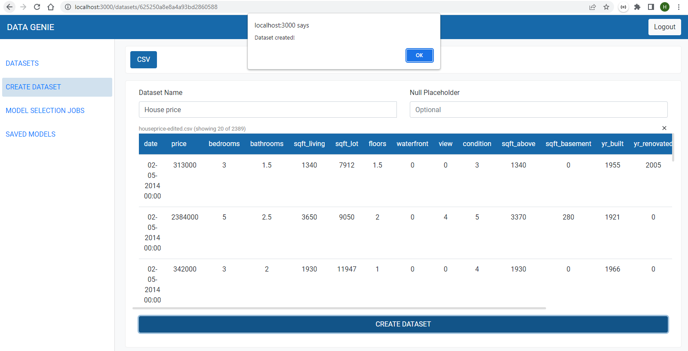
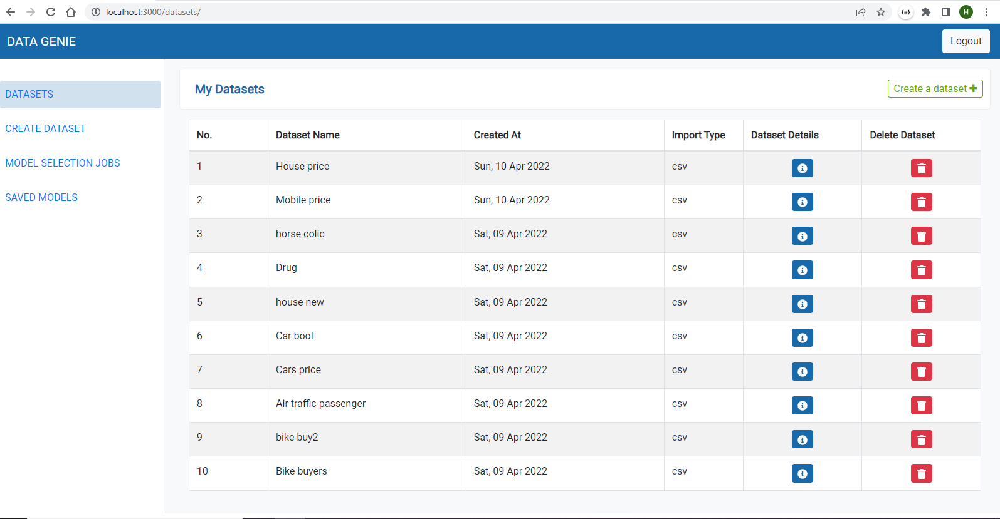
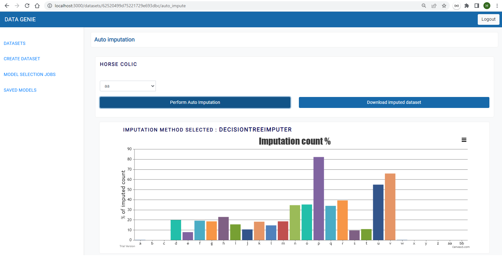
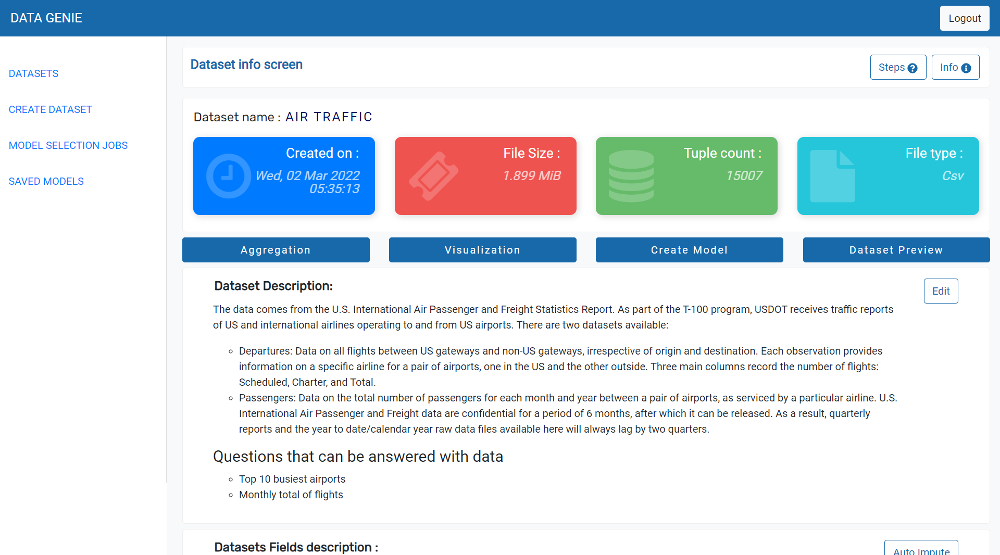
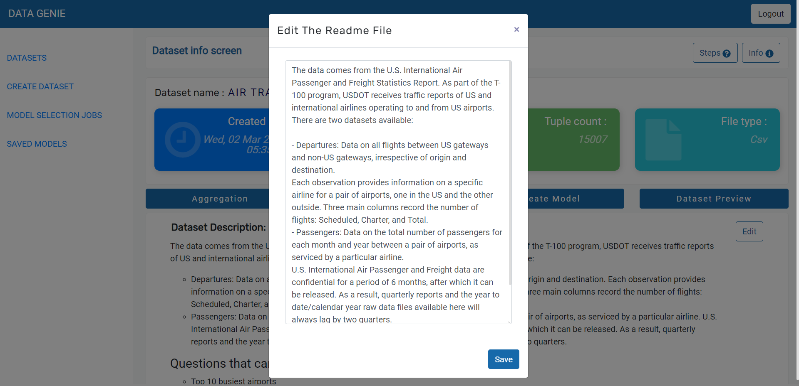
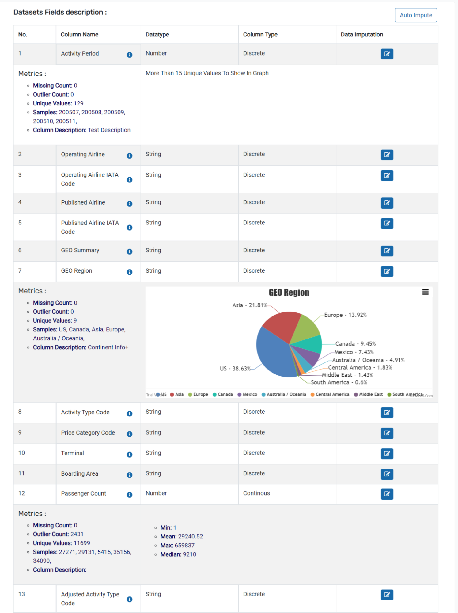
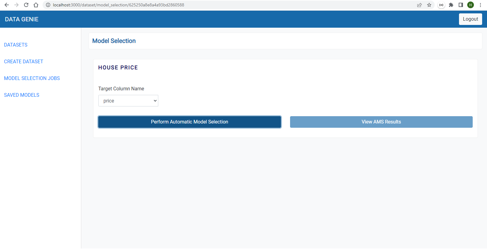
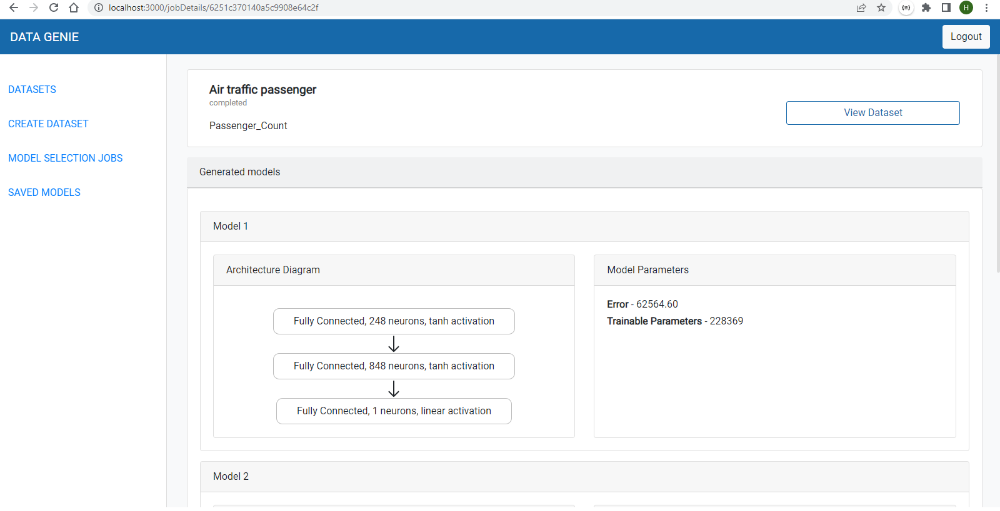

<div align="center">
 

 

#### [Video Demo](https://drive.google.com/file/d/10p4r3wa1Y-nxx--XNP4PvDVosOR3lvg1/view?usp=share_link)
 
[](https://code.visualstudio.com/  "Visual Studio Code")
[](mongodb.com "MongoDB")
[](https://www.python.org/)
[](https://reactjs.org/)
</div>

## Need ##
Not everyone has knowledge of ML and their models to recognize certain types of patterns within a huge dataset. To an ordinary user, it would be very difficult training a model over a set of data, providing it with an algorithm that it can use to reason over and learn from that data and also perform operations like preprocessing, imputation, visualization etc. A system to input data and get appropriate diagnosis along with an auto selected model would come in handy especially to the modern industrial sectors. The platform allows users who don't have any background knowledge of ML or its models and operations to predict and analyze data
with ease.

## Description ##
A platform that eases the work of data and business analysts in generating inferences from data without having knowledge of the coding side of things. It will provide complete data handling capabilities from ETL(Extract, Transform and Load) pipelines needed to build the dataset, automated data profiling and cleaning, analyzing how the data changes over time, improving the data quality. As the next step, neural networks would be automatically generated to perform classification or regression tasks on any target variable from the dataset. The platform will also create and suggest beautiful visualizations for the given dataset that can help drive decisions and understand the data at hand better.

## Features ##
- Allow the user to input a dataset in the form of CSV format.
- Perform basic operations on the input dataset such as identification of columns, their data types, statistics like mean, min, max, grouping etc.
- Perform data imputation for missing data for a given dataset.
- Prepare the input dataset by applying various preprocessing techniques like handling outlier, one hot encoding, feature scaling etc
- Develop an algorithm for Automatic Model Selection, using a genetic approach that automatically and efficiently finds the most suitable neural network model for a given dataset.
- Develop an auto data visualization algorithm to show top k data visualization for a given dataset.
 
## Application Screenshots ##
<div align="center">
 
#### **Home Page**
 


#### **Signup**

 
#### **Login**


 
#### **Dataset Input**


 
#### **Displaying all the datasets created by the user**


 
#### **Data Imputation**
 


#### **Dataset Details**


##### Edit Dataset Details

##### Dataset Catalog

 
#### **Data Visualisation**
 

 
#### **Model Selection**



##### After the model selection task is completed:



</div>

## How To Use
#### Software Requirements
- VSCode
- MongoDB

## Installation

Clone the repo
```html
git clone https://github.com/deepanshu2506/auto-ml.git
```

Install the dependencies by running:
```html  
pip3 install -r requirements.txt
```
```html  
yarn install
```


#### Run using Command Prompt

```html
flask run
```

```html
cd ./frontend
yarn start
```

---
### Tech stack

`Frontend` : React  <br>
`Backend` : Flask(Python)  <br>
`Database` : MongoDB <br>

------------------------------------------

<h3 align="center"><b>Developed  by <a href="https://github.com/deepanshu2506">Deepanshu Vangani</a> , <a href="https://github.com/Parth18Shah">Parth Shah</a> , <a href="https://github.com/Sakshi107">Sakshi Shelar</a> and <a href="https://github.com/hiral72">Hiral Sheth</a></b></h3>

